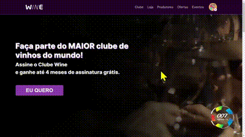

# Grupo 007 - Hackathon

Esse projeto foi desenvolvido no Hackathon organizado pela Trybe com a empresa parceira Wine.

## 📱 Projeto

Este projeto é uma landing page feita para a empresa Wine.



### 📋 Pré-requisitos

Para conseguir seguir este README e rodar o projeto você pode precisar dos seguintes itens:

- [Git](https://git-scm.com/doc)
- [Node](https://nodejs.org/en/)
- [Yarn](https://classic.yarnpkg.com/en/docs/getting-started)

## 🚀 Começando

Para ter acesso aos arquivos do projeto você pode clonar usando o seguinte comando:

```
git clone git@github.com:yMaatheus/hackathon-trybe-2022.git
```

### 🔧 Instalação

Agora que já tem a pasta do projeto na sua máquina, dentro dela instale as dependências:

```
yarn install
```

Então podemos rodar o projeto:

```
yarn dev
```

## 🛠️ Construído com

* [Yarn](https://classic.yarnpkg.com/en/docs/getting-started) - Gerente de dependências
* [React](http://www.dropwizard.io/1.0.2/docs/) - O framework web
* [Typescript](https://maven.apache.org/) - Linguagem de programação
* [Styled Components](https://styled-components.com) - Biblioteca para estilização por componentes
* [i18next](https://www.i18next.com) - Biblioteca gerenciadora de traduções

## ✒️ Autores

* **[Matheus Henrique](https://github.com/yMaatheus)**
* **[Allan Carvalho](https://github.com/gitdoallan)**
* **[Adison Reis](https://github.com/BaianorASR)**
* **[Emerson Alves](https://github.com/EmersonAlves019)**
* **[Diogo Martini Pantaleão](https://github.com/ogoiddev)**
